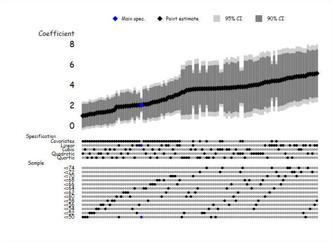

# speccurve
 Specification curve in Stata

Hi, 

the "file spec_curve_demo.do" shows how you can create  a specification curve (like the ones below) in Stata. The example uses the auto dataset in Stata. 

### Version 1: sorted by coefficient size

### Version: sorted by category (Brian Heseung Kim implementation)

#### Use 

* I created a small function to store estimates, but created the chart manually based on the stored estimates. 
* Brian Heseung Kim implemented the option to sort by category. To activate that just remove the "sort beta". 

#### License 
You are very welcome to use the code, change it, suggest improvements etc. You do not need to give me credit, but be kind to someone today. 

#### Credits
I was inspired to create this chart by Peter Eibich (https://www.demogr.mpg.de/en/institute/staff_directory_1899/peter_eibich_3594.htm) who had a similar chart in a presentation. So any credit should go to him

There is a lot of material on this out there that is much more sophisticated. See for example the work of Uri Simonsohn (number 37): http://urisohn.com/

Best,
Hans

